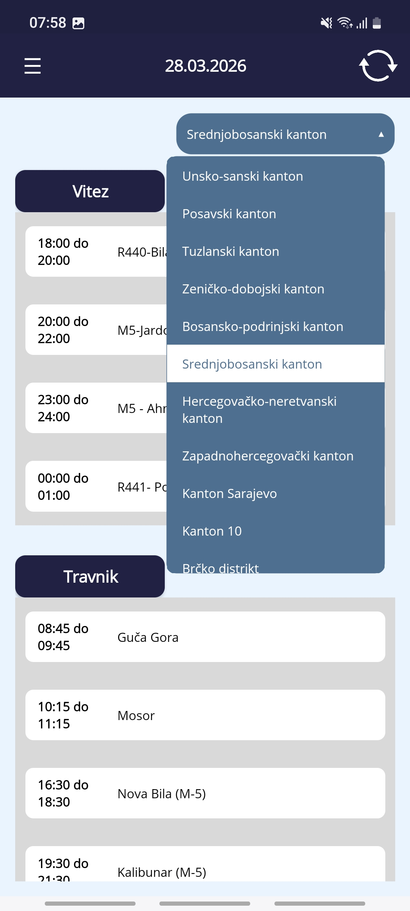
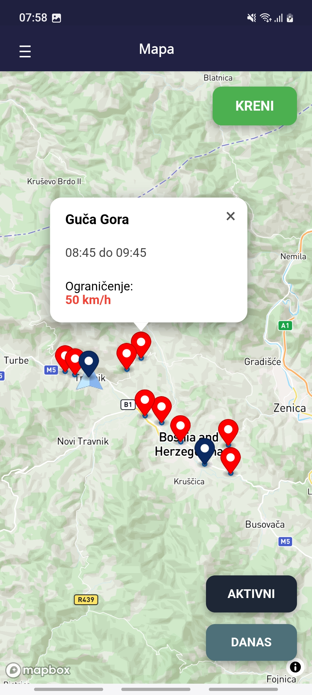
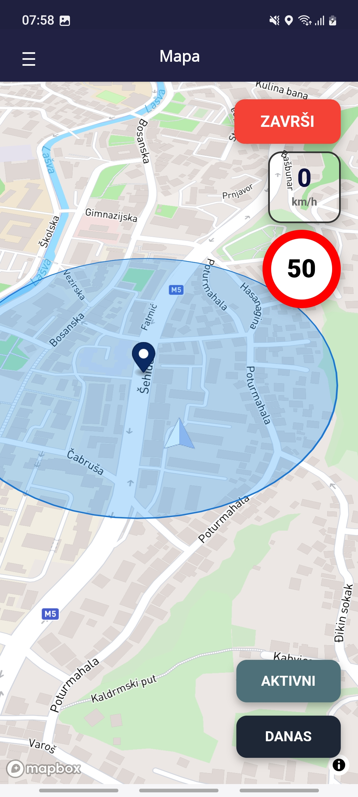
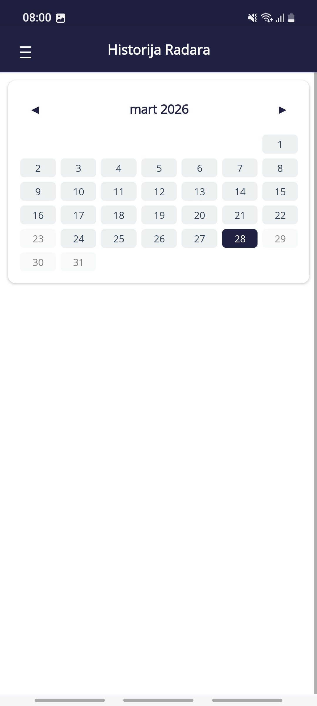

# RoadFlow

RoadFlow is a cross-platform .NET MAUI application designed to provide real-time information about radar speed controls. The application visualizes dynamic data on an interactive map and provides active notifications to users during transit.

## Project Purpose
This repository serves as a showcase of technical implementation and architecture. Please note that API keys and sensitive configurations have been omitted for security reasons. The project demonstrates the integration of external mapping services, cloud databases, and offline data persistence.

## Availability & Language
RoadFlow is currently available exclusively for **Bosnia and Herzegovina**.
The application interface is provided in **Bosnian language** only.
Support for additional regions and languages may be considered in future iterations.

## Key Features
* Real-time Radar Mapping: Visual representation of daily radar locations.
* Dynamic Data Updates: The application fetches and updates radar schedules that change on a daily basis.
* Active Navigation Support: Notifies users of upcoming speed controls while driving.
* Offline Mode: Users can access and read the complete list of radar controls at any time without an active internet connection.

## Project Structure
```
RoadFlow/
├── RoadFlow/
│   ├── Models/
│   │   ├── Canton.cs
│   │   ├── CantonPickerItem.cs
│   │   ├── FirebaseRadarItem.cs
│   │   ├── RadarCoordinate.cs
│   │   ├── RadarData.cs
│   │   ├── RadarFlatItem.cs
│   │   └── RadarLocation.cs
│   ├── Services/
│   │   ├── FirebaseService.cs
│   │   ├── LocationTrackingService.cs
│   │   ├── MapDataService.cs
│   │   ├── RadarAlertService.cs
│   │   ├── RadarConfig.cs
│   │   ├── RadarHistoryService.cs
│   │   ├── RadarParser.cs
│   │   └── Secrets.cs          # API keys (not included in repo)
│   ├── ViewModels/
│   │   ├── CityGroupViewModel.cs
│   │   └── RadarItemViewModel.cs
│   ├── Platforms/
│   │   ├── Android/
│   │   ├── iOS/
│   │   ├── MacCatalyst/
│   │   ├── Windows/
│   │   └── Tizen/
│   ├── Resources/
│   │   ├── AppIcon/
│   │   ├── Fonts/
│   │   ├── Images/
│   │   ├── Splash/
│   │   ├── Styles/
│   │   └── Raw/
│   │       ├── map.html        # Mapbox WebView entry point
│   │       ├── map.css
│   │       └── MapConfig.js    # Mapbox configuration
│   ├── MainPage.xaml           # Primary view
│   ├── MainPage.xaml.cs        # Partial class – entry point
│   ├── MainPage.Map.cs         # Partial class – map logic
│   ├── MainPage.History.cs     # Partial class – history logic
│   ├── AppShell.xaml
│   ├── App.xaml
│   ├── MauiProgram.cs
│   └── GlobalXmlns.cs
├── Screenshots/
└── RoadFlow.sln
```

## Technical Stack
* Framework: .NET MAUI
* Mapping: Mapbox API integrated via HTML and JavaScript components for customized visualization.
* Backend & Storage: Google Firebase for real-time data management and synchronization.
* Data Sourcing: Integration with external web resources for radar schedule scraping/fetching.
* Architecture: The project utilizes a Partial Class approach to manage page logic, optimized for performance and rapid navigation between the primary application views.

## Implementation Details
* Hybrid Rendering: Utilization of WebView components to bridge .NET logic with Mapbox JavaScript libraries, allowing for sophisticated map manipulation within a native container.
* Data Persistence: Implementation of local caching mechanisms to ensure the "Offline Mode" functionality remains reliable regardless of network availability.
* Security: API keys and endpoint secrets are managed externally and are not included in the source code to follow industry best practices.

## Screenshots

<p align="center">
    
    
    
    
</p>
<p align="center">
    
    
     
</p>
<p align="center">
    
    
</p>

---

> **Copyright (c) 2026 Amel Kolasević. All rights reserved.**
>
> **No part of this software may be copied, modified, or distributed without the express written permission of the author.**